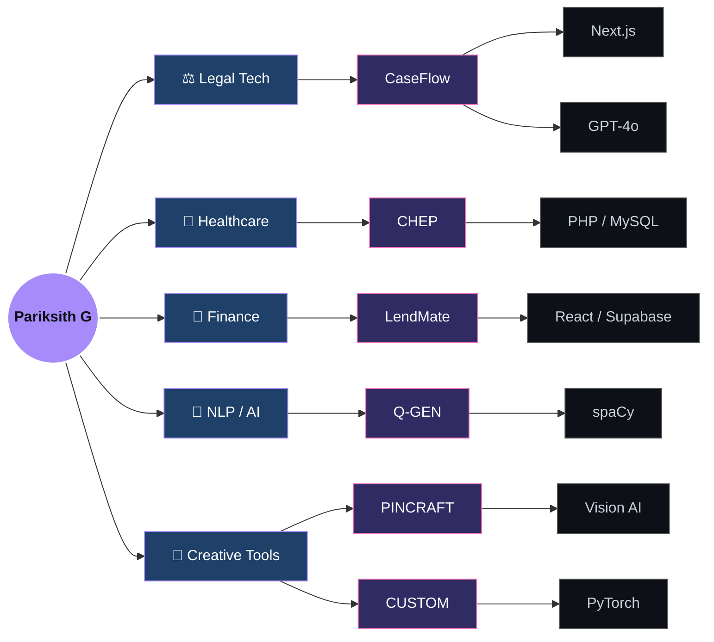

<div align="center">


</div>

```bash
pariksith@dev:~$ whoami
```
```
> Pariksith G
> AI & Data Science Student · Full-Stack Developer
> Location: Coimbatore, India
> Uptime: student by day, shipping by night
> Status: Now It's Personal...
```

```bash
pariksith@dev:~$ cat philosophy.txt
```
```
I don't build demos. I build platforms.
LegalTech. HealthTech. FinTech. NLP.
Opinionated, domain-specific software — built by someone who cares.
```

<div align="center">

<a href="https://github.com/pariksith"></a>
<a href="https://pariksith.netlify.app/"></a>
<a href="https://in.linkedin.com/in/pariksith-ganesh-kumar-537a5336a"></a>
<a href="https://leetcode.com/u/pariksith24/"></a>


</div>

<br/>

## `ps aux` — running processes

| PID | PROJECT | ROLE | STACK | CPU | STATE |
|:---:|---|---|---|:---:|:---:|
| `01` | **[CaseFlow](https://github.com/pariksith/CASEFLOW)** | AI litigation workflow → court-ready legal notices | `Next.js` `GPT-4o` `Supabase` | `92%` | 🟢 [live](https://caseflows.vercel.app/) |
| `02` | **[CHEP](https://github.com/pariksith/COMPLETE-HOSPITAL-ECOSYSTEM-PLATFORM)** | Full hospital ecosystem, ICU → telemedicine | `PHP` `MySQL` `PWA` | `88%` | 🟢 [live](https://chep.infinityfreeapp.com/index.php) |
| `03` | **[LendMate](https://github.com/pariksith/LENDING-MANAGEMENT-SYSTEM)** | Loan & collections management | `React` `TS` `Supabase` | `74%` | 🟡 repo |
| `04` | **[Q-GEN](https://github.com/pariksith/Q-GEN)** | Offline NLP quiz generator | `Python` `spaCy` | `65%` | 🟡 repo |
| `05` | **[PINCRAFT](https://github.com/pariksith/PINCRAFT)** | Image → AI shoot blueprint | `Python` `Vision` | `58%` | 🟡 repo |
| `06` | **[CUSTOM](https://github.com/pariksith/CUSTOM)** | Local AI story generator | `Gradio` `PyTorch` | `51%` | 🟡 repo |

<sub>🟢 deployed & live &nbsp;·&nbsp; 🟡 stable, source available</sub>

<br/>

## `pariksith --map-dependencies`



<br/>

## `pariksith --list-packages`

```
[stack]
  languages    ts · js · python · php
  frontend     react · nextjs · tailwind
  ai/nlp       gpt-4o · pytorch · huggingface · spacy
  backend      mysql · postgresql · mongodb · supabase
  devops       git · github · vercel · netlify

[installing...] ████████████████████████████████████████ 100%
[status] all packages up to date. building anyway.
```

<br/>

## `top -o uptime` — system stats

<div align="center">


</div>

<details>
<summary align="center"><code>expand --verbose</code> (activity graph, trophies, contribution snake)</summary>
<br/>
<div align="center">

<br/><br/>

<br/><br/>

</div>
</details>

<br/>

```bash
pariksith@dev:~$ cat /proc/status
```
```
projects_shipped     : 6+
backend_systems      : 4+
ai_integrations      : 4+
db_schemas           : 5+
live_deploys         : 2+
open_to_collab       : true
response_time        : fast (usually mid-build)
```

<br/>

```bash
pariksith@dev:~$ ./connect.sh
```

<div align="center">

<a href="https://github.com/pariksith"></a>
<a href="https://in.linkedin.com/in/pariksith-ganesh-kumar-537a5336a"></a>
<a href="https://pariksith.netlify.app/"></a>

<br/><br/>

`connection established.` `> LegalTech · HealthTech · FinTech · NLP · Real-time Systems`

<br/>

### *"The best time to ship was last week. The second best time is right now."*

<br/>


</div>
