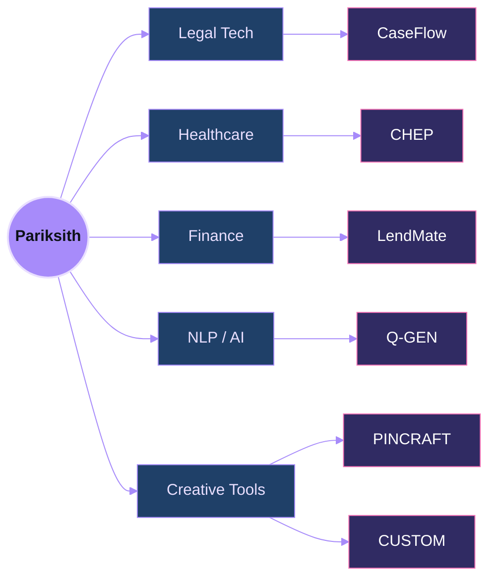

 

✦ &nbsp; COIMBATORE, INDIA &nbsp; ✦

 

 

### <i>"I don't build demos. I build platforms."</i>

LegalTech · HealthTech · FinTech · NLP — opinionated, domain-specific software, built by someone who cares

 

<a href="https://github.com/pariksith"><b>GITHUB</b></a> &nbsp;✦&nbsp;
<a href="https://pariksith.netlify.app/"><b>PORTFOLIO</b></a> &nbsp;✦&nbsp;
<a href="https://in.linkedin.com/in/pariksith-ganesh-kumar-537a5336a"><b>LINKEDIN</b></a> &nbsp;✦&nbsp;
<a href="https://leetcode.com/u/pariksith24/"><b>LEETCODE</b></a>

 

  

<h6 align="center">INDEX</h6>
<h3 align="center">
01&nbsp; <a href="#the-builder">The Builder</a> &nbsp;·&nbsp;
02&nbsp; <a href="#the-work">The Work</a> &nbsp;·&nbsp;
03&nbsp; <a href="#the-craft">The Craft</a> &nbsp;·&nbsp;
04&nbsp; <a href="#the-numbers">The Numbers</a> &nbsp;·&nbsp;
05&nbsp; <a href="#the-signal">The Signal</a>
</h3>

  

<h1 id="the-builder" align="center">Ⅰ. The Builder</h1>

 

<table width="100%" border="0">
<tr>
<td width="55%" valign="top">

While most people write assignments about neural networks, I'm integrating **GPT-4o into courtroom workflows**.

While most people read about databases, I'm designing **multi-role hospital systems** — ICU monitoring, telemedicine, triage, and payroll, all in one repository.

I move across the stack without hesitation — **TypeScript, PHP, React, Next.js, Python** — wherever the problem actually lives.

 

If a problem feels too complex for a weekend project, I spend the weekend solving it anyway.

</td>
<td width="45%" valign="top">

|  |  |
|---|---|
| ⚖️ | Legal Tech |
| 🏥 | Healthcare |
| 💸 | Finance |
| 🧠 | NLP & AI Tooling |
| 🎨 | Creative Tools |

</td>
</tr>
</table>

  

  

<h1 id="the-work" align="center">Ⅱ. The Work</h1>

 

<table width="100%" border="0">

<tr><td width="10%" valign="top"><h2>01</h2></td>
<td width="90%">

**CaseFlow** — *AI Litigation Workflow*
Converts raw client stories into court-ready Section 138 NI Act legal notices for Indian advocates, with deadline tracking and automated reminders.
Next.js 14 · TypeScript · GPT-4o · Supabase · Twilio
&nbsp;&nbsp;[Repo →](https://github.com/pariksith/CASEFLOW) &nbsp;·&nbsp; [Live →](https://caseflows.vercel.app/)

</td></tr>

<tr><td colspan="2"> </td></tr>

<tr><td width="10%" valign="top"><h2>02</h2></td>
<td width="90%">

**CHEP** — *Complete Hospital Ecosystem Platform*
A hospital in a repository — patient registration, doctor workflows, pharmacy, laboratory, ICU monitoring, telemedicine, payroll, and an AI health assistant.
PHP · MySQL · JavaScript · PWA
&nbsp;&nbsp;[Repo →](https://github.com/pariksith/COMPLETE-HOSPITAL-ECOSYSTEM-PLATFORM) &nbsp;·&nbsp; [Live →](https://chep.infinityfreeapp.com/index.php)

</td></tr>

<tr><td colspan="2"> </td></tr>

<tr><td width="10%" valign="top"><h2>03</h2></td>
<td width="90%">

**LendMate** — *Lending Management System*
Loan and collections platform tracking borrowers, EMI schedules, partner commissions, expenses, and financial reports with row-level security.
React · TypeScript · Supabase · PostgreSQL
&nbsp;&nbsp;[Repo →](https://github.com/pariksith/LENDING-MANAGEMENT-SYSTEM)

</td></tr>

<tr><td colspan="2"> </td></tr>

<tr><td width="10%" valign="top"><h2>04</h2></td>
<td width="90%">

**Q-GEN** — *Offline NLP Question Generator*
A rule-based engine using spaCy dependency parsing to generate Wh-questions, True/False, MCQ, and Cloze — each tagged by difficulty, zero API calls.
Python · spaCy
&nbsp;&nbsp;[Repo →](https://github.com/pariksith/Q-GEN)

</td></tr>

<tr><td colspan="2"> </td></tr>

<tr><td width="10%" valign="top"><h2>05</h2></td>
<td width="90%">

**PINCRAFT** — *AI Pinterest Recreation Tool*
Analyzes a reference image and generates a full shoot blueprint — scene, camera, lighting, editing, and shopping guidance.
Python · Vision AI
&nbsp;&nbsp;[Repo →](https://github.com/pariksith/PINCRAFT)

</td></tr>

<tr><td colspan="2"> </td></tr>

<tr><td width="10%" valign="top"><h2>06</h2></td>
<td width="90%">

**CUSTOM** — *Cinematic AI Story Generator*
A local writing app built with Gradio, Transformers, and PyTorch that turns a short prompt into a Story, Poem, or other output style.
Python · Gradio · PyTorch · HuggingFace
&nbsp;&nbsp;[Repo →](https://github.com/pariksith/CUSTOM)

</td></tr>

</table>

  

  

<h1 id="the-craft" align="center">Ⅲ. The Craft</h1>

 

LANGUAGES &nbsp;&amp;&nbsp; FRAMEWORKS
  

  

AI &nbsp;/&nbsp; NLP
  

  

BACKEND &nbsp;&amp;&nbsp; DATA
  

  

DEPLOY &nbsp;&amp;&nbsp; TOOLING
  

  

✦ &nbsp; view the constellation — how it all connects &nbsp; ✦

 

  

  

<h1 id="the-numbers" align="center">Ⅳ. The Numbers</h1>

 

<table border="0">
<tr>
<td align="center" width="140"><h1>6+</h1>PROJECTS SHIPPED</td>
<td align="center" width="140"><h1>4+</h1>BACKEND SYSTEMS</td>
<td align="center" width="140"><h1>4+</h1>AI INTEGRATIONS</td>
<td align="center" width="140"><h1>2+</h1>LIVE DEPLOYS</td>
</tr>
</table>

 

 

 

✦ &nbsp; activity graph, trophies &amp; contribution snake &nbsp; ✦

 

  

  

  

  

<h1 id="the-signal" align="center">Ⅴ. The Signal</h1>

 

Open to collaborations and serious builds.
 
LEGALTECH &nbsp;·&nbsp; HEALTHTECH &nbsp;·&nbsp; FINTECH &nbsp;·&nbsp; NLP &nbsp;·&nbsp; REAL-TIME SYSTEMS

  

<a href="https://github.com/pariksith"><b>FOLLOW ON GITHUB</b></a> &nbsp;✦&nbsp;
<a href="https://in.linkedin.com/in/pariksith-ganesh-kumar-537a5336a"><b>MESSAGE ON LINKEDIN</b></a> &nbsp;✦&nbsp;
<a href="https://pariksith.netlify.app/"><b>VIEW PORTFOLIO</b></a>

   

<i>"The best time to ship was last week. The second best time is right now."</i>

 

